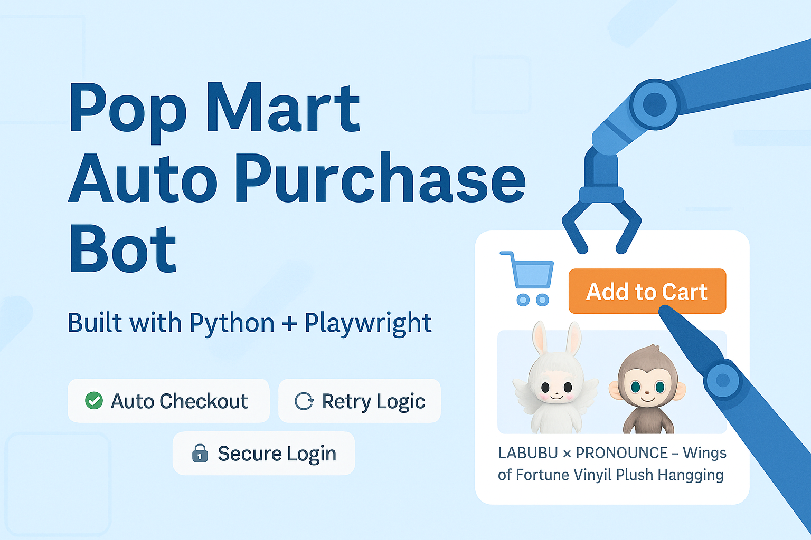

# 📦 Pop Mart Auto Purchase Bot

A Python automation bot that logs into your Pop Mart account, monitors product availability, sets quantity, and completes the checkout process — all automatically.

---

## 🚀 Features

- 🔐 Secure login using `.env`

- 🛒 Auto-selects quantity and adds to cart

- 💳 Navigates full checkout and payment flow

- 🔁 Retry logic with customizable attempts

- 🧠 Human-like scrolling to avoid detection

- ⚙️ Configurable via `config.yaml`

- 🧪 Debug mode with visible browser option

- 📂 Auto-logs activity in `popmart_bot.log`

---

## 📁 Folder Structure

```
popmart_bot/
├── popmart_bot.py         # Main bot script
├── config.yaml            # Product and settings config
├── .env                   # Login credentials
├── requirements.txt       # Dependencies
└── README.md              # This file
```

---

## 🧪 Requirements

- Python 3.9+

- Playwright

- `pip install -r requirements.txt`

---

## 🛠️ Setup Instructions

### 1. Clone the Repo or Upload Your Files

```bash
git clone https://github.com/abu-sinan/popmart_bot.git
cd popmart_bot
```

### 2. Install Dependencies

```bash
pip install -r requirements.txt
playwright install
```

### 3. Add Your Login Info to `.env`

```
EMAIL=your@email.com
PASSWORD=yourpassword
```

### 4. Configure Products in `config.yaml`

```yaml
products:
  - url: "https://www.popmart.com/us/product/12345"
    quantity: 2
  - url: "https://www.popmart.com/us/product/67890"
    quantity: 1
```

### 5. Run the Bot

```bash
python popmart_bot.py         # Headless (background)
python popmart_bot.py --debug # Debug mode (visible browser)
```

---

## ⚙️ `config.yaml` Example

```yaml
login_url: "https://www.popmart.com/us/user/login"
log_level: "INFO"
headless: true
max_retries: 3
delay_range: [60, 120]

products:
  - url: "https://www.popmart.com/us/product/abc123"
    quantity: 1
```

---

## 📜 Notes

- The bot **auto-restarts** if it crashes

- Logs are saved in `popmart_bot.log`

- `.env` is ignored in Git and **should never be shared**

---

## 🧠 Coming Soon (Optional Upgrades)

- Captcha detection

- Telegram/Email alerts

- Proxy support for stealth

- Session cookie reuse

- Auto-schedule via cron or systemd

---

## 📄 License

MIT License — Free to use, share, and modify.
© 2025 Abu Sinan